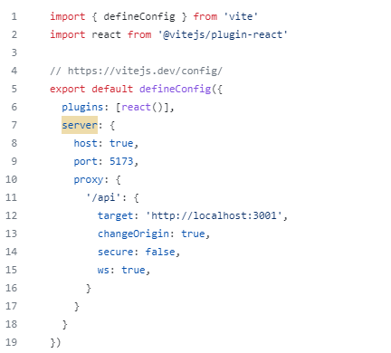
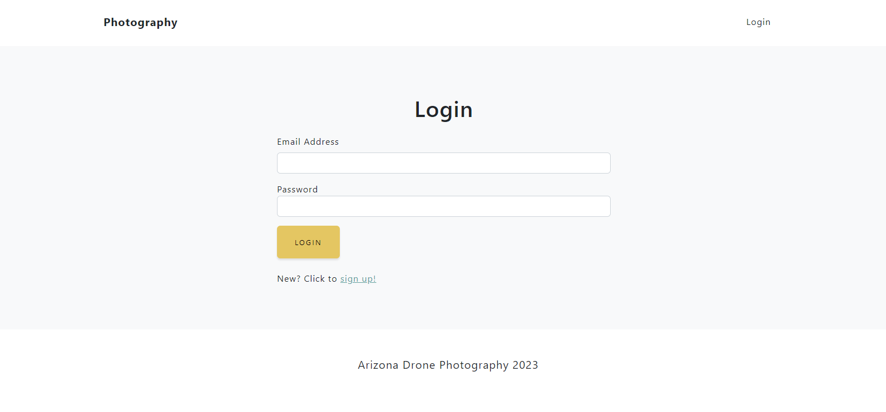
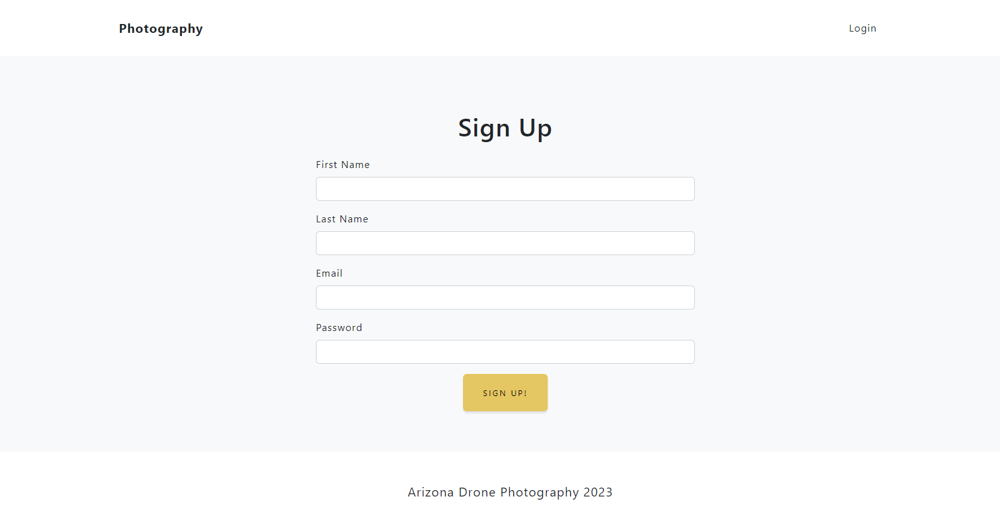
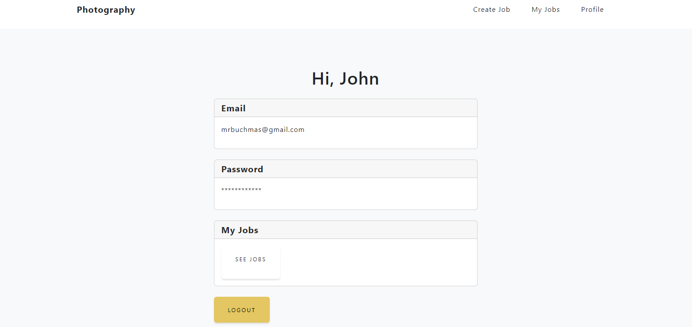
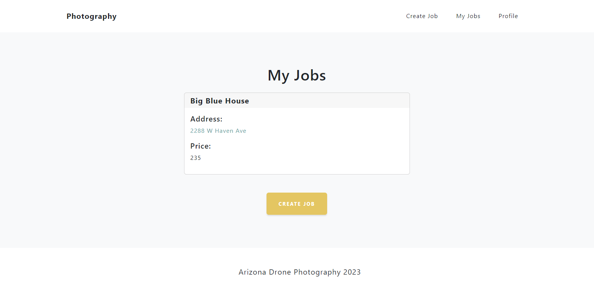
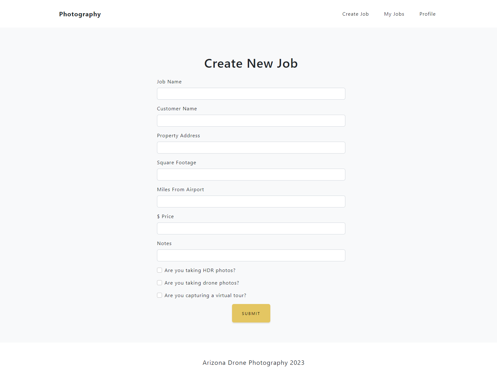

# Photography Photo Shoot Planner

# Table of Contents

1. [Description](#description)
2. [License](#license)
3. [Installation](#installation)
4. [Live Link](#live-link)
5. [Screenshots](#screenshots)

## Description
This web application helps a real estate photographer plan his/her photo shoot when they get a new job. It utilizes the TomTom API to generate a map based on the inputted address. It then tells the user how many photos to take based on square footage and a ballpark estimate on any flight restrictions for possible drone photos based on proximity to airports. 

User can create profiles with a login password and create jobs that are saved to their profile. They can view these jobs via the "My Jobs" page. 

This web app is built on the MERN stack, and I currently have the server and client hosted separately. The database structure is built with Mongoose and MongoDB. I used React Router to navigate through the different pages on the front end. 

Future features soon to be added are ability to delete jobs, ability to modify job details, ability to upload photos via AWS S3 bucket, and ability to share viewable links to jobs with uploaded photos to potential clients.

## License                        
Licensed under the The MIT License    
          

## Installation                     

Ensure that you have `Node.js` and `MongoDB` installed locally on your machine,then follow the instructions below:                  

1. First install all dependencies. You can run the scripts at the top level directory from the package json to do this: `npm i` , `npm run install-client` , and `npm run install-server`
2. In the server directory, navigate to `config/connection.js` and ensure that the correct mongoDB connection is listed per your local environment. 
3. In the client directory, navigate to `vite.config.js` and list your proxy if running locally. For example, this is the proxy I had listed when running locally: `server: {`
    `host: true,`
    `port: 5173,`
    `proxy: {`
      `'/api': {`
        `target: 'http://localhost:3001',`
        `changeOrigin: true,`
        `secure: false,`
       ` ws: true,`
      `}`
    `}`
  `}`                        
  ( or see below: )                                           
  <<<<>>>>
  
  <<<<>>>>                     

  4. Create a .env File with a variable named: `VITE_MAP_API_KEY1=` . This is the TomTom API key used to generate the map on the "Results" page. You will need to generate your own API key and place it in the .env file.
  5. Look throughout the pages in the client directory to remove any instance of `apiBaseUrl` called in fetch requests to the server. If running locally, your proxy setup in step 3 will work instead of the environment variable being used to call the deployed server.
  6. At the top level directory, run `npm run develop` to start up your server and client via concurrently. 

## Live Link
https://photoplanner.netlify.app/

## Screenshots                     

### Home Page
 .png)       
               
 .png)           

 ----------
 ----------                

### Map Results Page                   
 .png)               
                      
 .png)                  

----------
----------                    

### Login, Signup, and Profile Pages                                     
               
                            
               
                            
                   

----------
----------                                

### View Jobs and Create Jobs Page                   

                 
       
                 

       

